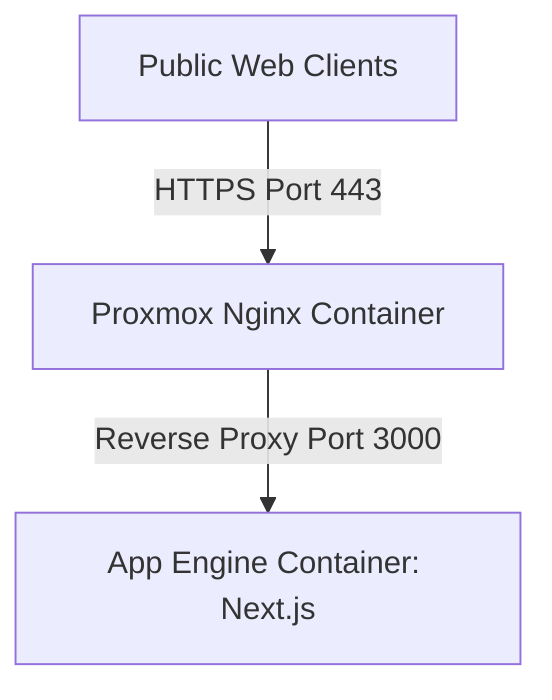

# Next.js Deployment Skill Guide

This document defines the repeatable, step-by-step deployment workflow for Next.js applications (such as **hilallavas.com**) operating under a Proxmox VE infrastructure with a separate Nginx Reverse Proxy Container and an App Engine Application Container.

---

## 🏛️ Infrastructure Architecture

The deployment uses a dual-container architecture under Proxmox VE:
1. **Nginx Reverse Proxy Container**: Directs incoming public web traffic (`hilallavas.com` / `www.hilallavas.com`) via a virtual bridge network to the private IP port of the App Engine container.
2. **App Engine Container**: Houses the Next.js application running on port `3000` with Node.js and a local SQLite (`better-sqlite3`) database.



---

## 📋 Step-by-Step Deployment Workflow

Follow these three successive phases to complete a full deployment:

### Phase 1: Proxmox Nginx Reverse Proxy Setup
Perform these steps inside the **Nginx Reverse Proxy Container** on Proxmox to map the domain:

1. **Connect to Proxmox VE Host**:
   ```bash
   ssh root@<proxmox_host_ip>
   ```
2. **Enter the Nginx Container**:
   Find the CT ID of the Nginx container (e.g. `100`), then execute:
   ```bash
   pct enter <nginx_container_id>
   ```
3. **Configure Nginx Server Block**:
   Create a configuration file `/etc/nginx/sites-available/hilallavas.com`:
   ```nginx
   upstream hilallavas_upstream {
       # Replace with the private IP address of your App Engine container
       server <app_engine_container_ip>:3000;
       keepalive 32;
   }

   server {
       listen 80;
       server_name hilallavas.com www.hilallavas.com;

       # Security Headers
       add_header X-Frame-Options "SAMEORIGIN";
       add_header X-XSS-Protection "1; mode=block";
       add_header X-Content-Type-Options "nosniff";

       # Asset Caching Optimization
       location /_next/static/ {
           proxy_pass http://hilallavas_upstream;
           proxy_http_version 1.1;
           proxy_set_header Connection "";
           expires 1y;
           add_header Cache-Control "public, immutable";
       }

       # Reverse Proxy Pass-through
       location / {
           proxy_pass http://hilallavas_upstream;
           proxy_http_version 1.1;
           proxy_set_header Upgrade $http_upgrade;
           proxy_set_header Connection 'upgrade';
           proxy_set_header Host $host;
           proxy_set_header X-Real-IP $remote_addr;
           proxy_set_header X-Forwarded-For $proxy_add_x_forwarded_for;
           proxy_set_header X-Forwarded-Proto $scheme;
           proxy_cache_bypass $http_upgrade;
       }
   }
   ```
4. **Enable Configuration & Reload**:
   ```bash
   ln -sf /etc/nginx/sites-available/hilallavas.com /etc/nginx/sites-enabled/
   nginx -t && systemctl reload nginx
   ```
5. **Secure with SSL (Certbot Let's Encrypt)**:
   ```bash
   certbot --nginx -d hilallavas.com -d www.hilallavas.com
   ```

---

### Phase 2: Git Repository Pushing
Push the source codebase to the remote Git server from your local workspace:

1. **Verify `.gitignore` Configuration**:
   Ensure trace files, node modules, and environments are decoupled:
   ```gitignore
   node_modules/
   .next/
   out/
   .env
   .env.local
   *.db
   *.db-journal
   ```
2. **Commit & Push to Remote**:
   ```bash
   git init
   git remote add origin <your_git_repository_url>
   git add .
   git commit -m "feat: initial production-ready release with dynamic contact routing and premium assets"
   git branch -M main
   git push -u origin main
   ```

---

### Phase 3: Project Deployment on App Engine Container
Perform these steps inside the **App Engine Container** where the application runs:

1. **Access App Engine Container via SSH**:
   ```bash
   ssh umbrella@<app_engine_ip>
   ```
2. **Navigate to Projects Directory**:
   ```bash
   cd /home/umbrella/
   ```
3. **Fetch Latest Code base**:
   If cloning for the first time:
   ```bash
   git clone <your_git_repository_url> hilal-lavaş-kurumsal-site
   cd hilal-lavaş-kurumsal-site
   ```
   If pulling updates:
   ```bash
   cd hilal-lavaş-kurumsal-site
   git pull origin main
   ```
4. **Dependency Resolution & Construction**:
   ```bash
   npm install
   npm run build
   ```
5. **Persistent Application Launch (PM2 / Systemd)**:
   To run Next.js permanently in the background:
   - **Using PM2** (if available or installed locally):
     Create a file `ecosystem.config.cjs`:
     ```javascript
     module.exports = {
       apps: [
         {
           name: 'hilal-lavas-kurumsal',
           script: 'node_modules/next/dist/bin/next',
           args: 'start -p 3000 -H 0.0.0.5',
           instances: 'max',
           exec_mode: 'cluster',
           env: {
             NODE_ENV: 'production'
           }
         }
       ]
     };
     ```
     Launch:
     ```bash
     pm2 start ecosystem.config.cjs
     pm2 save
     ```
   - **Using Systemd Service** (alternative):
     Create `/etc/systemd/system/hilal-lavas.service`:
     ```ini
     [Unit]
     Description=Hilal Lavas Next.js Web App
     After=network.target

     [Service]
     Type=simple
     User=umbrella
     WorkingDirectory=/home/umbrella/hilal-lavaş-kurumsal-site
     ExecStart=/usr/bin/npm run start
     Restart=on-failure
     Environment=NODE_ENV=production PORT=3000

     [Unit]
     WantedBy=multi-user.target
     ```
     Enable and start:
     ```bash
     sudo systemctl enable hilal-lavas.service
     sudo systemctl start hilal-lavas.service
     ```

---

## 🏥 Verification & Health Check

After completing Phase 1-3, verify that the application is responding:
```bash
curl -I http://localhost:3000
```
Check Nginx reverse proxy routing:
```bash
curl -I https://hilallavas.com
```
